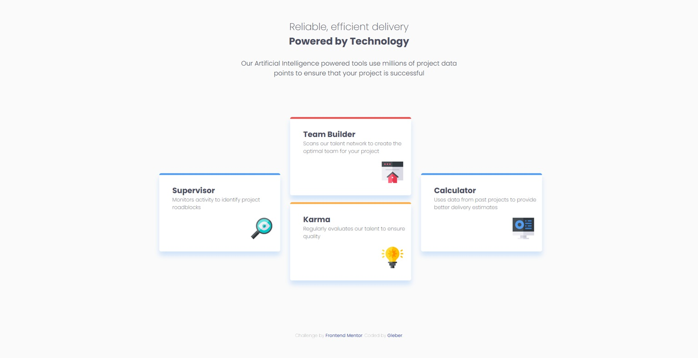

# Frontend Mentor - Four card feature section solution

This is a solution to the [Four card feature section challenge on Frontend Mentor](https://www.frontendmentor.io/challenges/four-card-feature-section-weK1eFYK). Frontend Mentor challenges help you improve your coding skills by building realistic projects. 

## Table of contents

- [Overview](#overview)
  - [The challenge](#the-challenge)
  - [Screenshot](#screenshot)
  - [Links](#links)
- [My process](#my-process)
  - [Built with](#built-with)
  - [What I learned](#what-i-learned)
  - [Continued development](#continued-development)
  - [Useful resources](#useful-resources)
- [Author](#author)


## Overview

### The challenge

In this challenge, I developed the page for mobile devices first, but with the goal of making it adaptable to various screen sizes.

### Screenshot




### Links

- Solution URL: [Four Card](https://github.com/GleberC/four-card)
- Live Site URL: [Four Card](https://four-card-flax.vercel.app/)

## My process

### Built with

- Semantic HTML5 markup
- CSS custom properties
- Flexbox
- CSS Grid
- Mobile-first workflow

### What I learned

I used CSS Grid to arrange the elements for larger screens. I used this feature for the first time and I was able to see that it makes arranging the cards much easier.

These are the exemples of new codes I used:

```css
.drawer{
        position: relative;
        right: 35%;
        width: 60rem;
        display: grid;
        grid-template-columns: 20rem 20rem 20rem;
        grid-template-rows: 33% 33% 33% ;
        row-gap: 1.5rem;

    }

.supervisor {
        grid-area: 2/1/3/2;
        align-self: self-end;
        justify-self: center;
    }

```

### Continued development

I have been making progress in the challenges with the goal of reinforcing HTML and CSS techniques, but with the main objective of developing my skills in JavaScript.


## Author

- Website - [GleberC](https://github.com/GleberC)
- Frontend Mentor - [GleberC](https://www.frontendmentor.io/profile/GleberC)


